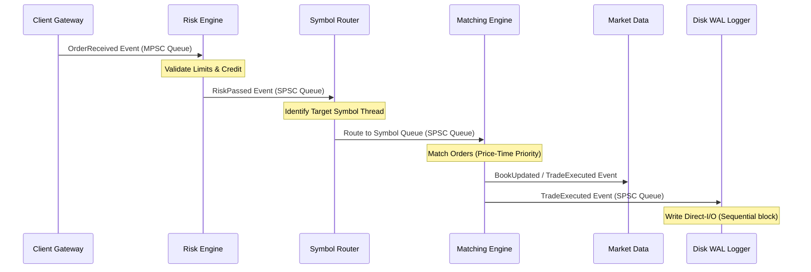

# FluxTrade Architecture Specification

FluxTrade is an ultra-low-latency electronic exchange and execution venue written in Modern C++20. This document provides the high-level system design, concurrency model, and execution pathways.

---

## 1. System Philosophy

FluxTrade is designed around three performance principles:
1. **Zero Heap Allocations in the Hot Path**: All execution objects (Orders, Trades, Events) are recycled via preallocated block `ObjectPool` allocators. System calls to the OS allocator (`new`/`delete`) are strictly forbidden during execution.
2. **Single-Threaded Core Isolation**: To eliminate lock contention and scheduler jitter, each symbol's limit order book is managed by a single thread pinned to a dedicated CPU core.
3. **Event-Driven CQRS Pipeline**: Modules communicate purely by emitting and consuming standardized binary event frames routed through custom lock-free queues.

---

## 2. Directory Structure & Module Map

```text
FluxTrade/
├── common/        # Core utilities (SPSC/MPSC lock-free queues, ObjectPool, pinning)
├── config/        # Unified configuration module (YAML mapping)
├── events/        # Shared event contracts (OrderReceived, TradeExecuted, etc.)
├── kernel/        # Bootloader (topological sort, DI container, thread supervisor)
├── core/          # Sequencing gateway & session tracking
├── risk/          # Pre-trade risk validation engine
├── orderbook/     # Double-linked price levels and Limit Order Books
├── matching/      # Price-Time priority matching engine
├── router/        # Multi-thread symbol router
├── execution/     # Trade fill and allocation logic
├── marketdata/    # L1, L2, L3 book publishers
├── scheduler/     # Heartbeats and timer loops
├── metrics/       # observabilities and counter registry
├── monitoring/    # Alerting watchdogs
├── network/       # Asynchronous Boost.Asio I/O socket gateway
├── storage/       # Direct-I/O WAL and Postgres persistence
├── tests/         # GoogleTest suites
└── benchmarks/    # Google Benchmark latency suites
```

---

## 3. Concurrency & Threading Model

To guarantee sub-microsecond determinism, the Kernel binds critical threads to specific physical CPU cores:

```text
Thread 0 (Core 0)  ──> Network I/O Reactor (Boost.Asio Poll)
Thread 1 (Core 1)  ──> Risk Engine (Validates incoming orders)
Thread 2 (Core 2)  ──> Symbol Router (Routes orders to symbols)
Thread 3 (Core 3)  ──> Symbol Matching Engine: BTCUSDT (1 thread per symbol)
Thread 4 (Core 4)  ──> Symbol Matching Engine: ETHUSDT
Thread N (Core N)  ──> WAL Logger (Sequential Direct-I/O writer)
```

- **Thread Hops**: Lock-free SPSC (Single-Producer Single-Consumer) ring buffers are used for point-to-point hops.
- **Client Merging**: Bounded MPSC (Multi-Producer Single-Consumer) queues are used to merge order flows from multiple gateway connections.

---

## 4. End-to-End Order Flow

The sequence diagram below represents the asynchronous lifecycle of an order:



For component-level implementations and API structures, refer to [KERNEL.md](file:///Users/ayishikdas/Projects/FluxTrade/docs/KERNEL.md).
For architectural decision history and trade-off details, refer to the [ADR/](file:///Users/ayishikdas/Projects/FluxTrade/docs/ADR/) directory.
