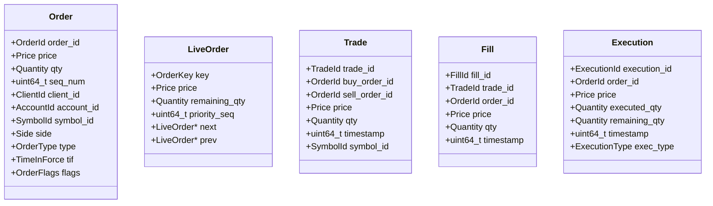

# FluxTrade Domain Module Specification

The **Domain Module** defines the core, immutable business objects used across the FluxTrade trading platform.

---

## 1. Design Philosophy

To sustain high-performance, deterministic execution:
1. **Trivially Copyable**: All domain entities are Plain Old Data (POD) structs. They contain no virtual functions, RTTI, or heap allocations. This enables zero-copy movement across thread boundaries using lock-free queues.
2. **Zero-Overhead Strong Types**: Custom strong identifier templates prevent parameter mixing (e.g. passing a `SymbolId` into an `OrderId` parameter) without introducing runtime wrapper structures or function call overhead.
3. **Fixed-Precision Value Objects**: All prices and quantities are wrapped in fixed-precision 64-bit value objects (`Price` using $10^8$ ticks scale, `Quantity` using $10^6$ units scale). Floating-point arithmetic is avoided in the matching loop to ensure absolute decimal rounding accuracy.

---

## 2. Strong Typing System

We implement a template class `StrongId<Tag, Underlying>` resolving to its underlying type at compilation time.

```cpp
template <typename Tag, typename Underlying = uint64_t>
class StrongId { ... };
```

### Concrete Identifiers
- **`OrderId`** (uint64_t)
- **`TradeId`** (uint64_t)
- **`ExecutionId`** (uint64_t)
- **`FillId`** (uint64_t)
- **`ClientId`** (uint32_t)
- **`AccountId`** (uint32_t)
- **`SymbolId`** (uint32_t)
- **`OrderKey`**: Composite pairing of a `SymbolId` and `OrderId` for routing map lookups.

---

## 3. Entity Memory Layouts

All structures are packed to fit perfectly inside L1 cache lines (64-byte chunks).

### 3.1 Order Entity (64 Bytes, 8-Byte Aligned)
Fits exactly in **one single L1/L2 cache line**:
```text
+--------------------------------------------------------+
| 00: OrderId (StrongId, uint64_t)              [8 bytes]|
+--------------------------------------------------------+
| 08: Price (Fixed-precision price, int64_t)    [8 bytes]|
+--------------------------------------------------------+
| 16: Quantity (Fixed-precision qty, uint64_t)  [8 bytes]|
+--------------------------------------------------------+
| 24: SequenceNumber (uint64_t)                 [8 bytes]|
+--------------------------------------------------------+
| 32: ClientTimestamp (uint64_t nanoseconds)    [8 bytes]|
+--------------------------------------------------------+
| 40: ExchangeTimestamp (uint64_t nanoseconds)  [8 bytes]|
+--------------------------------------------------------+
| 48: ClientId (StrongId, uint32_t)             [4 bytes]|
+--------------------------------------------------------+
| 52: AccountId (StrongId, uint32_t)            [4 bytes]|
+--------------------------------------------------------+
| 56: SymbolId (StrongId, uint32_t)             [4 bytes]|
+--------------------------------------------------------+
| 60: Side (1B) | Type (1B) | TIF (1B) | Flags (1B)     |
+--------------------------------------------------------+
```

### 3.2 LiveOrder Node (Doubly-Linked List, Matching Path)
Used inside the order book structure:
- `OrderKey key` (12 bytes)
- `Price price` (8 bytes)
- `Quantity remaining_qty` (8 bytes)
- `uint64_t priority_seq` (8 bytes)
- `LiveOrder* next` (8 bytes)
- `LiveOrder* prev` (8 bytes)

---

## 4. Entity Relationships



---

## 5. Order State & Priority Progression

To prevent write amplification on immutable entities, the original client `Order` remains completely unmodified. State and priority are managed via mutable `LiveOrder` nodes in the matching engine:

```text
  [Inbound Order]
         │
         ▼
    Create Order (Immutable, client-facing parameters)
         │
         ▼
  Enters OrderBook
         │
         ▼
    Create LiveOrder (Sets remaining_qty = order.qty, links to book list)
         │
         ▼
    Order Execution (Mutable decrement of LiveOrder::remaining_qty)
         │
  ┌──────┴──────┐
  ▼             ▼
[Partial Fill] [Full Fill]
                │
                ▼
           Delete LiveOrder (Unlink node, return to ObjectPool)
```
