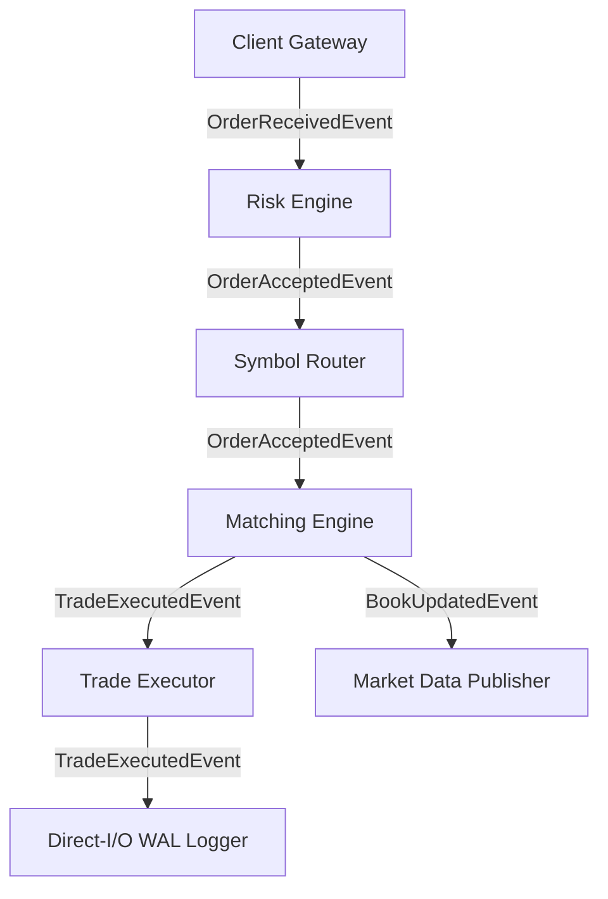
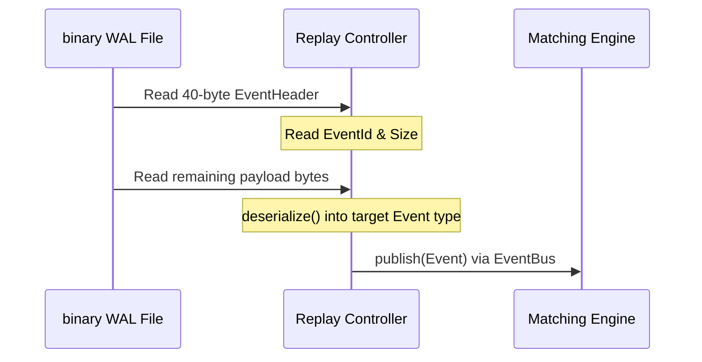

# FluxTrade Events Module Specification

The **Events Module** defines the standardized message contracts (the domain language) spoken by every subsystem inside FluxTrade. 

---

## 1. Design Philosophy

To sustain sub-nanosecond operations and deterministic latency profiles:
1. **Composition over Inheritance**: We avoid polymorphic base classes. Inheritance introduces vtable pointer lookups and runtime dynamic casts (`dynamic_cast`), which invalidate CPU instruction pipelines. Instead, every event embeds a standard `EventHeader` as its first member.
2. **Plain Old Data (POD)**: All events are configured as standard-layout, trivially copyable structures.
3. **Zero Heap Allocations**: Events are allocated on stack boundaries or retrieved from thread-local `ObjectPool` allocators. No dynamic memory managers are invoked during event construction or dispatch.

---

## 2. Memory Layout & Cache Alignment

To prevent compiler-inserted padding and optimize CPU L1/L2 cache line utilization (typically 64 bytes), fields are packed strictly on their natural alignment boundaries:

### Common EventHeader (40 Bytes, 8-Byte Aligned)
```text
+--------------------------------------------------------+
| 00: Timestamp (uint64_t)                      [8 bytes]|
+--------------------------------------------------------+
| 08: SequenceNumber (uint64_t)                 [8 bytes]|
+--------------------------------------------------------+
| 16: CorrelationId (uint64_t)                  [8 bytes]|
+--------------------------------------------------------+
| 24: SymbolId (uint32_t)  | 28: EventId (uint32_t)      |
+--------------------------------------------------------+
| 32: Source (uint16_t)    | 34: Version (uint16_t)      |
+--------------------------------------------------------+
| 36: Flags (uint8_t)      | 37: Padding (uint8_t x 3)   |
+--------------------------------------------------------+
```

### Event Struct Sizes (Header Included)
- **`HeartbeatEvent`**: **40 bytes**
- **`OrderRejectedEvent` / `OrderCancelledEvent` / `TradeCancelledEvent`**: **56 bytes**
- **`BookUpdatedEvent`**: **64 bytes**
- **`OrderReceivedEvent` / `OrderAcceptedEvent` / `TradeExecutedEvent`**: **72 bytes**

---

## 3. Serialization Protocol

FluxTrade uses raw binary serialization. Serialization and deserialization are implemented as bound-checked memory copy operations (`std::memcpy`).

```text
       [Event Structure (RAM)]
                  │
                  ▼ serialize() (std::memcpy)
+---------------------------------------------+
| Raw Binary Stream (File / Network Buffer)   |
+---------------------------------------------+
                  │
                  ▼ deserialize() (std::memcpy)
                  │
                  ▼
   [Trivially Copyable Event (Target RAM)]
```

### Versioning Strategy
Every `EventHeader` carries an `EventVersion` field. 
- Protocol changes append new fields strictly to the end of the structures.
- Because structures are parsed based on type sizes, backward compatibility is maintained by reading only up to the size specified by the incoming `EventVersion` frame.

---

## 4. End-to-End Event Routing Flow



### Deterministic Replay Flow
The replayer parses stored WAL binary logs, reads the `EventHeader` to determine the `EventId`, reconstructs the target event structure using `deserialize()`, and dispatches it directly into the matching engine.


