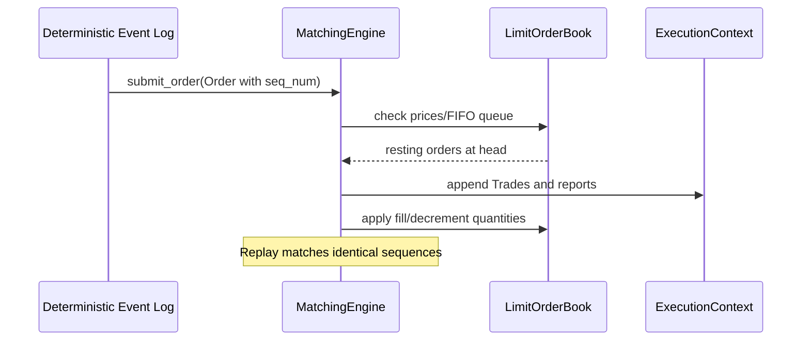

# FluxTrade Matching Engine Specification

The **Matching Engine** is the core deterministic execution engine of the FluxTrade exchange. It processes order submissions, matches crossing interest, and maintains state sequence counts.

---

## 1. Architecture & Design Philosophy

To maximize cache locality, instruction predictability, and memory safety:
1. **Stateless Matching Loop**: The matching core maintains no state outside of sequence numbers. Market state is completely owned and stored inside the `LimitOrderBook`.
2. **Preallocated Scoped Context ([execution_context.hpp](file:///Users/ayishikdas/Projects/FluxTrade/matching/include/matching/execution_context.hpp))**: All matching operations take a reference to a stack-recycled `ExecutionContext` which preallocates trade and report buffers, achieving **zero dynamic heap allocation** inside the hot matching loop.
3. **TradeBuilder Factory ([trade_builder.hpp](file:///Users/ayishikdas/Projects/FluxTrade/matching/include/matching/trade_builder.hpp))**: Standardizes the construction of execution records (ACKs, Trades, Fills, Cancellations, Rejections, Expirations), preventing manually coded state changes inside the matching core.
4. **ExchangeSimulator Symbol Orchestration ([exchange_simulator.hpp](file:///Users/ayishikdas/Projects/FluxTrade/matching/include/matching/exchange_simulator.hpp))**: A multi-symbol simulator mapping symbol identifiers to individual isolated matching engine engines, simplifying future distributed scaling.

---

## 2. Memory Layouts & Sizes

### ExecutionReport (64 Bytes, 8-byte Aligned)
Aligns exactly to one L1/L2 CPU cache line:
```text
+--------------------------------------------------------+
| 00: ExecutionId exec_id (uint64_t)            [8 bytes]|
+--------------------------------------------------------+
| 08: OrderId order_id (uint64_t)                [8 bytes]|
+--------------------------------------------------------+
| 16: Price price (Fixed-precision, int64_t)    [8 bytes]|
+--------------------------------------------------------+
| 24: Quantity last_qty (Fixed-precision)       [8 bytes]|
+--------------------------------------------------------+
| 32: Quantity remaining_qty (Fixed-precision)  [8 bytes]|
+--------------------------------------------------------+
| 40: uint64_t timestamp                        [8 bytes]|
+--------------------------------------------------------+
| 48: ClientId client_id (uint32_t)             [4 bytes]|
+--------------------------------------------------------+
| 52: AccountId account_id (uint32_t)            [4 bytes]|
+--------------------------------------------------------+
| 56: SymbolId symbol_id (uint32_t)             [4 bytes]|
+--------------------------------------------------------+
| 60: RejectReason (2B) | ExecType (1B) | Pad (1B)      |
+--------------------------------------------------------+
```

---

## 3. Algorithmic Complexity

| Scenario | Complexity | Isolated Latency (Release Build) | Notes |
| :--- | :--- | :--- | :--- |
| **Submit Resting Limit Order** | $O(\log L)$ | **67.1 ns** | Search level + LOB enqueue |
| **Crossing Match (1 Trade)** | $O(1)$ | **68.9 ns** | Matches head, generates 1 Trade, 2 reports |
| **Multi-Level Sweep (5 Levels)** | $O(M)$ | **161.5 ns** | Sweeps 5 levels, generates 5 Trades, 10 reports |
| **Cancel Active Order** | $O(1)$ | **65.9 ns** | Lookup + intrusive list unlink + report |
| **Modify Order Qty** | $O(1)$ | **2.67 ns** | Price/Qty priority adjustment |

---

## 4. Sequence & Deterministic Replay Flow

To guarantee deterministic replay:
1. Ordering inside the matching loop depends solely on the external `SequenceNumber` attached to each incoming order, NOT on thread timestamps.
2. Latency metrics utilize lightweight, monotonic `Clock::now_steady()` measurements.
3. Every execution run replayed twice with identical sequence logs produces identical states and execution outputs.



---

## 5. Future Order Types Extension Points

*   **Self-Trade Prevention (STP)**: Checked via the `can_self_trade` virtual/inlined helper hook. Can be easily extended to read client group IDs.
*   **Iceberg Orders**: Implemented by modifying the resting remainder insertion logic (only showing a portion of the order quantity while maintaining the hidden size).
*   **Auctions**: Can be integrated by bypassing the continuous matching loops and calling batch-clearing matching algorithms on the book levels.
