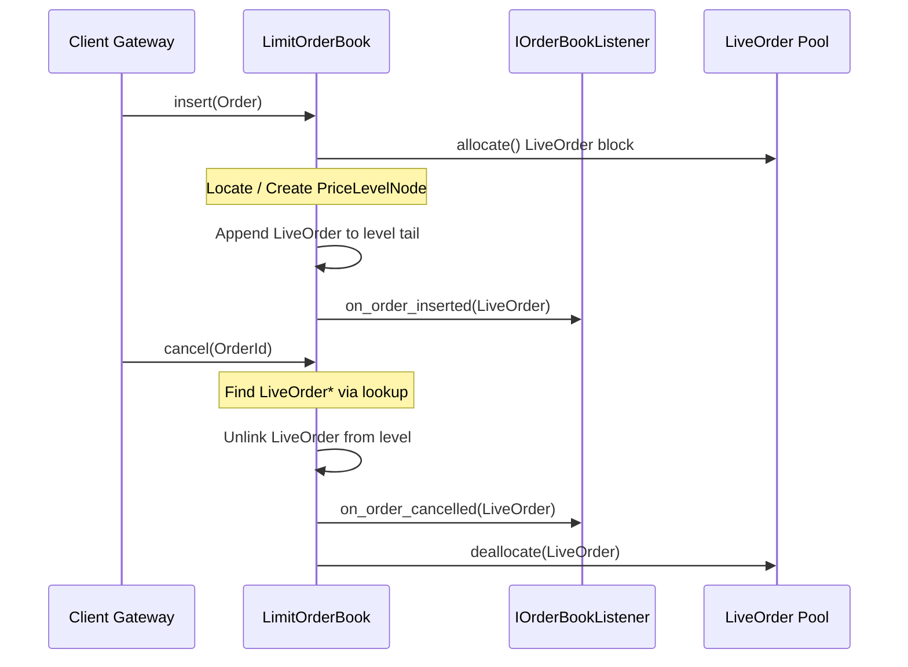

# FluxTrade Limit Order Book Specification

The **Limit Order Book (LOB)** is the core data structure of the matching engine. It aggregates and sequences buyer and seller interest at discrete price levels, prioritizing orders based on a strict price-time priority rule.

---

## 1. Design Decisions & Decoupled Architecture

To maximize CPU cache hits and eliminate hot-path instruction branches:
1. **Decoupled Bid and Ask books**: Instead of placing Bids and Asks in a single class with multiple conditional branches, we separate them into `BidBook` (sorted descending) and `AskBook` (sorted ascending). This removes conditional branching inside insertion and level traversal pathways.
2. **Intrusive FIFO Queues**: We avoid heap-allocated list node wrappers (e.g. `std::list`). Instead, `LiveOrder` structures act as doubly-linked list nodes directly (`prev`/`next` pointers are stored directly on the payload). This maintains perfect spatial cache locality and ensures $O(1)$ queue operations.
3. **Index Abstraction**: We decouple the sorting lookup tree from the order book using `PriceLevelIndex`. The initial implementation uses standard red-black trees (`std::map`), but we can replace it with radix trees, dense tick arrays, or B-trees later without modifying the core order book code.
4. **O(1) Cancellation lookup**: The `OrderLookup` class wraps hash map indices mapping `OrderId` to `LiveOrder*` pointers, allowing immediate node unlinking in constant time.
5. **No Heap Allocations**: Price levels and orders are recycled through preallocated single-threaded `ObjectPool` allocators.

---

## 2. Data Structures & Memory Layouts

```text
LimitOrderBook
  ├── BidBook (Sorted Descending)
  │     └── PriceLevelIndex<greater>
  │           └── PriceLevelNode (Linked List Head/Tail)
  │                 └── LiveOrder (Intrusive doubly-linked list nodes)
  ├── AskBook (Sorted Ascending)
  │     └── PriceLevelIndex<less>
  │           └── PriceLevelNode
  │                 └── LiveOrder
  └── OrderLookup (std::unordered_map<OrderId, LiveOrder*>)
```

### PriceLevelNode Layout (48 Bytes, 8-Byte Aligned)
- `Price price` (8B)
- `Quantity total_qty` (8B)
- `uint32_t order_count` (4B)
- `uint32_t padding` (4B)
- `IntrusiveOrderList orders` (16B - Head & Tail pointers)
- `PriceLevelNode* next` (8B)
- `PriceLevelNode* prev` (8B)

---

## 3. Algorithmic Complexity

| Operation | Complexity | Latency (Release Build) | Notes |
| :--- | :--- | :--- | :--- |
| **Insert (Existing Level)** | $O(1)$ | **23.4 ns** | Appends `LiveOrder*` to queue tail |
| **Insert (New Level)** | $O(\log L)$ | **67.5 ns** | Inserts and links sorted `PriceLevelNode` |
| **Cancel Order** | $O(1)$ | **28.7 ns** | Pointer unlink via `OrderLookup` |
| **Modify Quantity (Shrink)**| $O(1)$ | **2.67 ns** | Decrements remaining quantity |
| **Modify Quantity (Grow)** | $O(1)$ | **2.67 ns** | Unlinks and re-appends to queue tail |
| **Best Bid/Ask Query** | $O(1)$ | **0.29 ns** | Direct head pointer access |

---

## 4. Entity Interactions & Mutation Flow



---

## 5. Invariants Enforcement

To prevent state corruption, the book runs static and runtime assertions:
- `BidBook` prices must strictly descend; `AskBook` prices must strictly ascend.
- A level's `total_qty` and `order_count` must be greater than zero. If they reach zero, the level must be immediately unlinked and returned to its pool.
- Pointers inside `LiveOrder` nodes must form valid doubly-linked references (i.e. if `o1->next == o2`, then `o2->prev == o1`).
- The `OrderLookup` map size must exactly equal the total number of orders across all price levels.
